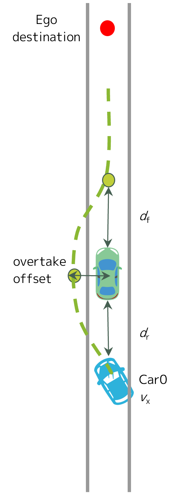

# Feature: Overtake the ego outside of the Lanelet

To ensure the ADS can safely handle being overtaken while stationary,
the Ego vehicle must wait for the maneuver to complete before departing.

## Scenario Outline: Overtake from left side

Confirm the vehicle avoids a collision when another vehicle overtakes from the left.

* Given Ego is in standstill
* And Car0 is positioned behind Ego, in the same driving lane
* And Car0 is driving at <vx_car0> towards Ego
* When Car0 reaches a position at distance <dr> behind Ego
* And Car0 starts overtaking Ego
* Then Ego remains standstill
* When Car0 reaches a position <df> ahead of Ego
* And Car0 finishes the overtake maneuver
* Then Ego starts driving
* And Ego reaches the destination without collision
* And Ego does not decelerate at a rate below <amin_ego> during driving

### Examples

  | vx_car0 | dr    | df    | overtake_offset | amin_ego   |
  | ------- | ----- | ----- | --------------- | ---------- |
  | 10 km/h | 7.0 m | 5.0 m | 2.5 m           | -1.5 m/s^2 |
  | 15 km/h | 7.0 m | 5.0 m | 2.5 m           | -1.5 m/s^2 |
  | 20 km/h | 7.0 m | 5.0 m | 2.5 m           | -1.5 m/s^2 |
  